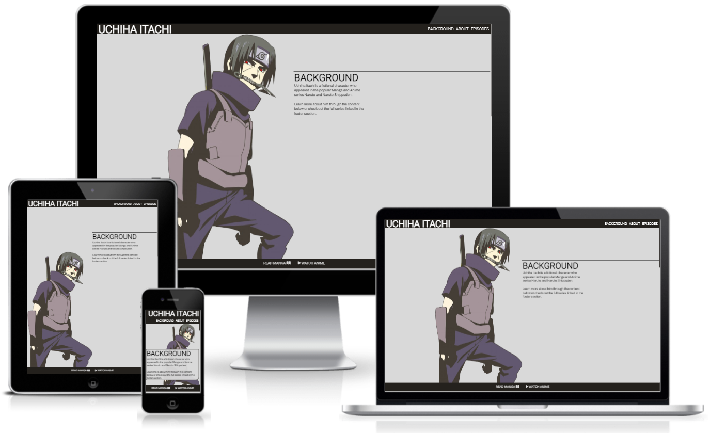

# The Uchiha Itachi Project

The Uchiha Itachi project is aimed at showcasing the character Uchiha itachi. It is meant for fans of the anime series and the character himself to consume selected content focused on the character, as well as for people unfamiliar with anime and manga who can get an introduction to a fascinating character, as well as amazing artwork, and hopefuly awaken an interest in the genre.

## Features 

The website has an initial warning page as well as a main website that contains all content devided into 3 sections.
Apart from this, the site has a header and a footer, both in fixed positions to always be accesible to the user.

### Existing Features

- __Navigation Bar__

  - Featured as a fixed item always displaying at the topp of the page, in order for the user to always have navigation options at hand.
  - The navigationbar in the first index warning page does not contain the navigation links to page sections, in order to not distract the user from the warning message. 

- __The index warning page__

  - The index page is a warning to the user, and allows the user to think twice before entering. Perhaps a user who is fascinated by the character but have only come halfway through the series, would choose to not enter the main page. 
  - This page also introduces the genre and awakens an interest by displaying some beautiful artwork.
  included in the footer is also links to external resources where you can read the manga and watch the anime series.
  - This page has its own css stylesheet as much of the content initialy differed from the main page. This could probably be better organized.

- __The main page header__

  - The header section is mainly created to highlight the amazing artwork highlight the genre for the content.
  - It also displays the background and purpose of the page and what the user can expect to find. 

- __About Section__

  - The about section allows the user to find content that explaines more about the context and story of character Uchiha Itachi.  
  - This can spark an interest in the genre, the character and for the series.

- __Episodes__

  - This section will allow the user to navigate through the series in order to find episodes where the character is featured. For example, a user who watched the series a long time ago might find it useful to navigate to specific parts where the Itachi is featured in the series. 

- __The Footer__ 

  - The footer section includes links to the external pages where one can read the manga or watch the anime series. 
  - The footer is also fixed and always on display for the user. To always encourage them to get into reading or watching.

### Features Left to Implement

- The about section would be interesting to build out in order for users to contribute with content and upload artwork or link to video content that they think should be featured to describe Itachi.

## Testing 

Testing has been conducted and only one performance issue found through lighthouse remains unattended. Other then that, no unfixed bugs have emerged in the testing.

The most interesting problem was the page height. Managing to create a page size that enables each section of the page to be viewed seperately.

Text boxes are styled to fit screen sizes down to about 315px width.

### Validator Testing 

- Lighthouse returned;
  - index page: Performance 97, Accessibility 95, Best Practices 100, SEO 100
  - main page: Performance 82, Accessibility 96, Best Practices 92, SEO 100

- HTML
  - [W3C validator](https://validator.w3.org/nu/?doc=https%3A%2F%2Fjensbrauer.github.io%2Fichihaitachi%2F) returned no errors.
- CSS
  - [(Jigsaw) validator](https://jigsaw.w3.org/css-validator/validator?uri=https%3A%2F%2Fjensbrauer.github.io%2Fichihaitachi%2F&profile=css3svg&usermedium=all&warning=1&vextwarning=&lang=sv) returned no errors.

### Unfixed Bugs

No unfixed bugs have been found during testing.

## Deployment

- The site was deployed to GitHub pages using the following steps: 
  - In the GitHub repository, navigate to the Settings tab 
  - From the left side menu, navigate to pages
  - Select main branch and hit save.
  - As the page build is finished, a link to the page is provided in the pages section.

The live link can be found here - https://jensbrauer.github.io/ichihaitachi/ 

## Credits 

### Content 

- The video content displayed on the page is provided by youtubers featured below.
- Videos iframed from youtube creators
  - [samuelmeller1484](https://www.youtube.com/@samuelmeller1484)
  - [SagesRain](https://www.youtube.com/@SagesRain)
  - [tehsparkcjnorebirth](https://www.youtube.com/@tehsparkcjnorebirth3761)

- Instructions on how to implement scrollbar styling was taken from [This YouTube Tutorial](https://www.youtube.com/watch?v=lvKK2fs6h4I)

- The icons in the footer were taken from [Font Awesome](https://fontawesome.com/)

### Media

- The photos used on the home and sign up page are from [Claudia Frosini](https://www.kindpng.com/userpngs/734/) and [Simona Muccino](https://www.kindpng.com/userpngs/744/) at [KindPng](https://www.kindpng.com/).

